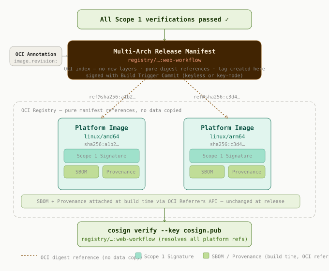

# Security Model

> **English** · [Deutsch](./SECURITY-MODEL.de.md)

`cibuild` follows a **security-first** supply chain model: cryptographic
traceability is not a feature bolted on at the end, it is the structural
foundation of how artifacts are built, tested, and released. Every artifact
is tied to an immutable digest, every digest is signed, and the entire chain
is verifiable by anyone, at any time, from any location.

This document describes the model. For configuration variables and operational
details, see the [reference documentation](../REFERENCE.md).

---

## Principles

**The commit is the cryptographic anchor.** Every build is triggered by a
commit — a developer push, a scheduled dependency update, a merge request.
That commit SHA is carried through the entire pipeline: into the OCI image
annotations (`org.opencontainers.image.revision`), into the signature, and
into the artifact lock file. Code and artifacts are bound together
cryptographically, not by convention.

**Work by digest, never by tag.** Tags are mutable — they can be overwritten,
moved, or garbage-collected. Once an image is built, every subsequent stage
resolves it by its immutable `sha256:` digest. Per-platform build tags exist
only transiently during the build and can be removed afterwards. Nothing
downstream depends on a tag remaining stable.

**The artifact is the proof.** A signed digest with its attestations attached
as OCI referrers *is* the security evidence. There is no separate
"security layer" sitting above the artifact — the artifact carries its own
provenance. This is the same idea as "test first" or "api first" applied to
security: the property is designed in, not inspected in afterwards.

**Minimal artifacts, minimal attack surface.** Every additional object in the
supply chain is a potential discrepancy and a verification risk. The model
favours the smallest possible set of objects that fully describes an artifact's
integrity and origin.

---

## The Artifact Lock File

After each platform build, an `artifact-lock.<platform_name>.json` file is
written and pushed to the OCI registry as a signed artifact 
(artifact-type "application/vnd.cibuild.artifact-lock+json"), co-located with
the image it describes. Two tags are maintained per platform:

- **`<image>:lock-<build-tag>-<commit-sha>-<platform>`** — immutable,
  commit-specific reference to the exact build that produced this lock
- **`<image>:lock-<build-tag>-latest-<platform>`** — mutable pointer to the
  most recent build of this tag, updated after every successful push

The lock file records the exact digests of the platform image and all its
supply chain referrers — SBOM, vulnerability report, provenance — together
with the signature digest and the source commit. Because the image is signed
and the referrers are bound to its digest, the entire chain is provably intact
whenever the lock artifact is read.

```json
{
  "platform":      "linux/amd64",
  "platform_name": "linux-amd64",
  "image":         "registry.example.com/myorg/myapp",
  "build_tag":     "main",
  "image_digest":  "sha256:abc123...",
  "referrers": {
    "sbom":        "sha256:def456...",
    "vuln":        "sha256:ghi789...",
    "provenance":  "sha256:jkl012..."
  },
  "build_client":  "buildctl",
  "source_commit": "a1b2c3d4...",
  "built_at":      "2024-11-15T10:30:00Z"
}
```

An optional condensation step (`cibuild_ci_condense_lock_artifacts`) can
mirror lock files back into the VCS after a merge, for workflows that require
lock data in the repository. This step is explicit and decoupled from the
build pipeline.

---

## Cryptographic Scopes

The model distinguishes two cryptographic scopes with different trust
characteristics.

### Build scope — static key

The build stage signs each platform image, its referrers, and its lock artifact
with a static key pair. The private key is injected as a secret; the public key
lives in the repository (e.g. `cosign.pub`) so that any consumer can verify.
This scope is appropriate for internal infrastructure where a known key pair is
managed by the organization.

The diagram below shows how the platform image, its referrers, the lock
artifact, and the signature form a single cryptographically bound object —
and how every stage, from build through testing to external governance,
re-verifies that signature against the digest rather than trusting a tag.


### Release scope — keyless

The release stage can sign the final multi-platform index using keyless
signing: the CI job's own identity, established through an OIDC token, is used
to obtain a short-lived certificate from a certificate authority, and the
signing event is recorded in a transparency log. No long-lived private key is
stored anywhere. This scope is appropriate for releases where a publicly
verifiable, auditable signing identity is desired.

The diagram below shows the keyless flow: the CI identity is exchanged for a
short-lived certificate, the multi-platform index is signed, and the signing
event is recorded in the transparency log — leaving a publicly auditable trail
without any stored key.



The two scopes are independent: an internal build can use a static key while
the public release is signed keyless, or both can use the same mode. What
matters is that each artifact is signed within a clearly defined scope and
that the verification path is unambiguous.

---

## Supply Chain Attestations

Each platform image carries its attestations as OCI referrers, bound to the
image digest:

```
application/vnd.cyclonedx+json        # CycloneDX SBOM
application/vnd.trivy.vuln+json       # CVE vulnerability report
application/vnd.slsa.provenance+json  # SLSA provenance
```

Because these referrers are attached to the digest and the digest is signed,
verifying the signature implicitly verifies which attestations belong to the
image. There is no ambiguity about which SBOM describes which build — the
cryptographic binding answers that question.

The artifact lock is stored as a separate OCI artifact alongside the image,
addressed by tag rather than attached as a referrer to the image digest:

```
application/vnd.cibuild.artifact-lock+json  # artifact lock
```

Both the commit-specific tag and the `latest` pointer are signed in the same
build scope, so the verification path is identical to that of the image itself.

### Verification across stages

Both the test stage and the release stage verify signatures before acting:

- The **test stage** pulls the platform lock artifact from the registry,
  verifies its cosign signature, and reads the platform digest from it. Tests
  therefore always execute against the exact digest that was built and signed —
  never against a mutable tag.

- The **release stage** pulls and re-verifies all platform lock artifacts, and
  only then assembles the multi-platform index.

Both stages resolve images by digest independently of tag state, so the
pipeline is tamper-evident across job boundaries and across runners.

---

## Compliance and Governance

Because the lock artifact exposes all artifact digests as plain JSON in the
registry, compliance and governance tooling can consume it directly:

```sh
# pull the latest lock for a given build tag and platform
regctl artifact get registry.example.com/myorg/myapp:lock-main-latest-linux-amd64 | jq .
```

- **SBOM consumers** (e.g. OWASP Dependency-Track, DevGuard) use
  `referrers.sbom` to fetch the CycloneDX SBOM by digest.
- **CVE / VEX pipelines** use `referrers.vuln` to fetch the vulnerability
  report and feed it into VEX generation.
- **Audit dashboards** combine `image_digest`, `source_commit`, and `built_at`
  to correlate image versions with source commits and scan results.

A compliance governance gate consuming these artifacts acts as a lifecycle
watcher: it verifies policy (CVE thresholds, SBOM completeness, license policy)
against the attestations before a release is permitted. This is distinct from
the technical verification performed during the build — governance checks
policy, not function. Both must pass before an artifact progresses.

---

## Reproducible Builds

When the build is reproducible — for example with the Nix build client — the
provenance guarantee is strengthened: the same inputs produce the same output
digest, byte for byte. The derivation hash itself becomes a strong statement of
provenance, independent of when or where the build ran. This is the natural
endpoint of the security-first model: an artifact whose integrity and origin
are not merely attested but structurally guaranteed.