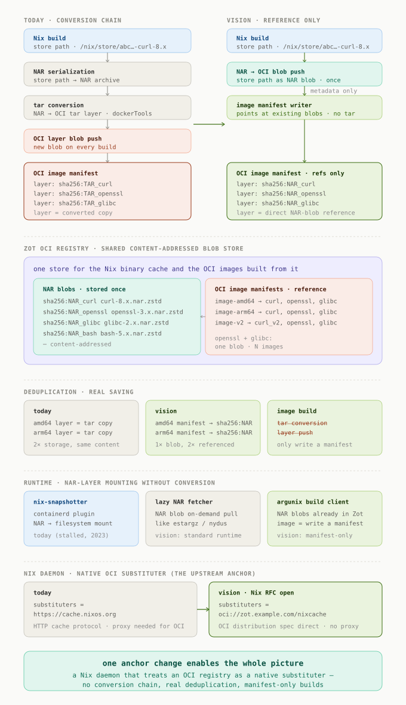

# Vision: Nix-native OCI

> **English** · [Deutsch](./VISION.de.md)

> **Status: this is a vision, not a feature.** None of what follows is
> implemented in cibuild today. Parts of it depend on upstream work that is
> still open (a native `oci://` substituter in the Nix daemon), parts exist only
> as stalled or experimental projects (`nix-snapshotter`, proxy approaches like
> `nixcache-oci` and `oranc`). It is documented here because the direction is
> coherent and worth thinking through — not because it is available.

---

Today, building an OCI image from Nix means a conversion chain: a Nix store path
is serialized to a NAR archive, the NAR is converted to a tar layer, and the tar
layer is pushed as a fresh blob — a new copy on every build, even when nothing
changed.

The vision removes the chain. If the Nix daemon could speak `oci://` directly,
store paths would already live in an OCI registry as content-addressed NAR
blobs. Building an image would then no longer mean *serializing* data, but
*referencing* it: the image manifest simply points at NAR blobs that already
exist. An image build would cost only the writing of a manifest — no data
transfer, no tar conversion.

Two consequences follow. First, **real deduplication**: two images that share
`glibc` share the exact same blob, not two identical tar layers; `amd64` and
`arm64` builds of the same package reference one blob, not two copies. Second,
the registry becomes a **single content-addressed store** for both the Nix
binary cache and the OCI images built from it — the same objects, referenced
from both sides.

On the runtime side, the same principle extends into the container runtime
itself: instead of materializing tar layers, NAR blobs are mounted on demand.
This is what `nix-snapshotter` set out to do for containerd as a snapshotter
plugin — mount a store path directly, without tar extraction — and what a lazy
NAR fetcher could generalize to standard runtimes, in the spirit of estargz or
nydus lazy pulling.

The diagram below lays out the full picture: the conversion chain as it is
today, the reference-only assembly as it could be, the shared blob store, the
runtime mounting, and the one upstream change that anchors all of it — a Nix
daemon that treats an OCI registry as a native substituter.

